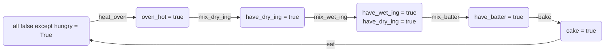

# GOAP Implementation

This details the structure I will use for my GOAP system. I am using Jeff Orkin's paper and Vinicius Gerevini's demo (see [notes.md](/notes.md)) as a launching off point, but will be implementing my own system as I see fit.

## Classes:
- `Goal`
    - Attributes:
        - `expected_state`: Dictionary. Expected state of the world (not exclusive--it only states whatever variables it is checking)
- `Action`
    - Attributes:
        - `preconditions`: Dictionary. Required state of the world to be executed
        - `cost`: integer. Cost of the action, determined by the developer.
        - `effects`: Dictionary. Changes made to the state of the world.
    - Methods:
        - `apply_effect`: details the changes made.
    - The examples I have seen implement separate classes for each action. I will do that here. 
- `Character`
    - Attributes:
        - `goals`: set. all goals assigned to that character.
        - `goal_queue`: priority queue implemented with heapq. Contains tuples of (priority (int), goal).
        - `name`: everyone needs a name.
    - Methods:
        - `get_goal`: return the highest priority goal.
- `Planner`

## world_state

`world_state` will be a dictionary detailing the entire state of the world. It will be mutable, but items will not be added or removed, only changed.

Changes by effects to world state will be done via a method outside of `Action` by returning the `effects` dictionary and altering the world state. We will use the `update` function.

have character use a priority queue for goals. This means we will have to assign priority within the agent's class, using a tuple or something.

The highest priority goal is taken care of, then popped from the queue. If world state ever changes 

## The Cooking Process

This graph shows the flow of actions and states to bake a cake.



### Goal:

There is one goal state: `not_hungry` where:
```python
{
    hungry = False
}
```

If `hungry = False` for some time, it reverts back to `True`, and we bake another cake.

This is the world state:
```python
{
    oven_hot: bool
    have_wet_ing: bool
    have_dry_ing: bool
    have_batter: bool
    cake: bool
    hungry: bool
}
```

### Actions

| Action            | Preconditions                                     | Effects                                                                       | 
|-------------------|-----------------------                            |-------------------                                                            |
| `heat_oven`       | `hungry = True`                                   | `oven_hot = True`                                                             |
| `mix_dry_ing`     | `oven_hot = True`                                 | `have_dry_ing = True`                                                         |
| `mix_wet_ing`     | `have_dry_ing = True`                             | `have_wet_ing = True`                                                         |
| `mix_batter`      | `have_dry_ing = True`<br>`have_wet_ing = True`    | `have_batter = True` <br> `have_dry_ing = False` <br> `have_wet_ing = False`  |
| `bake`            | `have_batter = True`                              | `cake = True` <br> `oven_hot = False` <br> `have_batter = False`              | 
| `eat`             | `cake = True`                                     | `cake = False`<br>`hungry = False`                                            |

Note that the effects of `mix_wet_ing` makes `have_wet_ing` true, without altering `have_dry_ing`.

We could add `oven_hot` as preconditions for all other actions that come after, but that is implied.

It could be beneficial to use enum style types for the world style types for the states. At the end of the day, though, it doesn't do much.